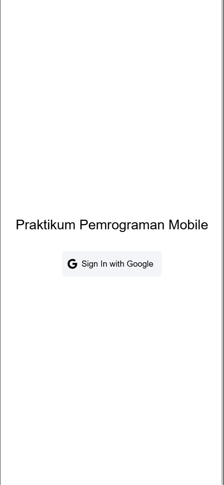
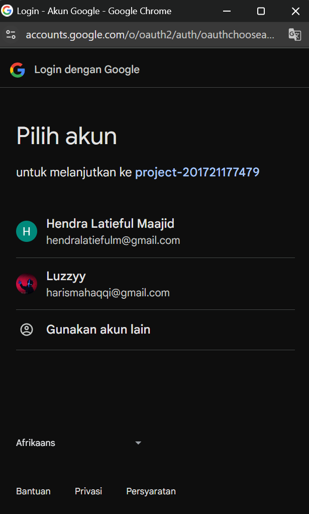
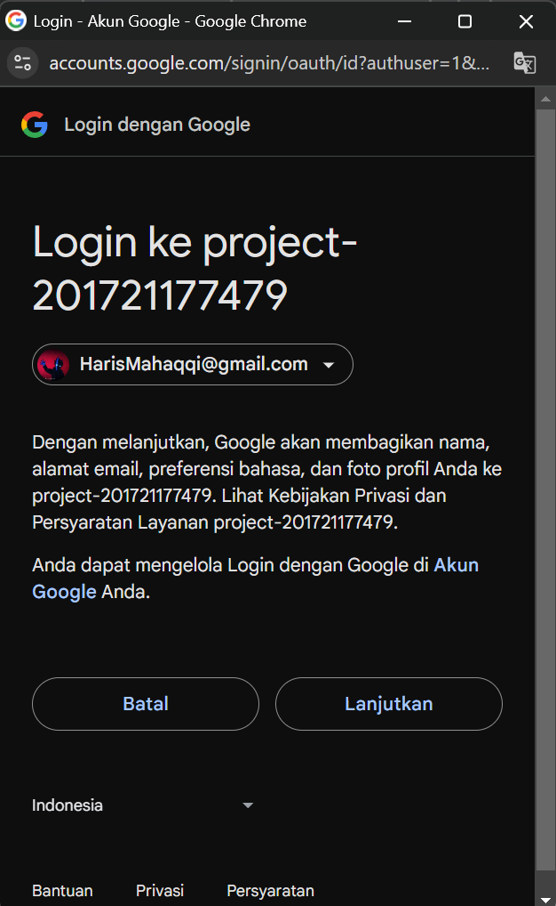
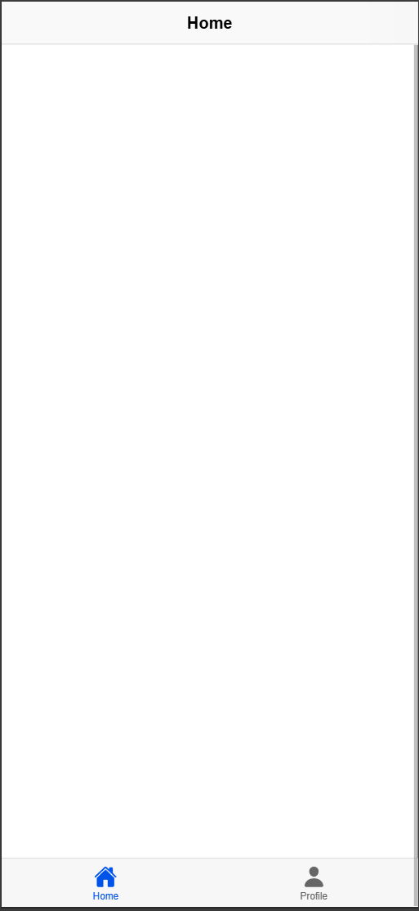
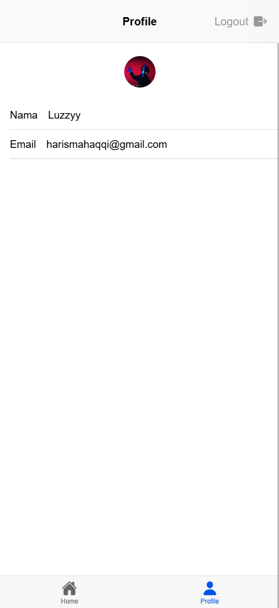

# Panduan CRUD Aplikasi To do list berbasis ionic vue
- Hendra Latieful Maajid
- H1D022018
- Shift Baru F
- Shift KRS D

## 1. Create (Membuat Todo Baru)

### Alur Proses Pembuatan Todo
1. **Interaksi Pengguna**
   - Pengguna menekan tombol "+" di pojok kanan bawah layar
   - Modal input terbuka dengan form judul dan deskripsi todo

2. **Validasi Input**
   - Sistem memeriksa apakah judul todo telah diisi
   - Jika judul kosong, akan muncul pesan peringatan

3. **Proses Pembuatan**
   - Data todo disiapkan dengan properti:
     * Judul (wajib)
     * Deskripsi (opsional)
     * Status awal: Aktif (false)
     * Waktu dibuat: Timestamp saat ini
     * Waktu diperbarui: Timestamp saat ini

4. **Penyimpanan di Firestore**
   - Todo disimpan dalam koleksi khusus pengguna yang sedang login
   - Setiap todo memiliki ID unik yang dibuat otomatis
   - Setelah berhasil, daftar todo diperbarui

### Contoh Kode Utama
```typescript
// Proses tambah todo
const handleSubmit = async (todo) => {
  // Validasi judul
  if (!todo.title) {
    await showToast('Judul harus diisi');
    return;
  }

  try {
    // Tambah todo ke Firestore
    await firestoreService.addTodo(todo);
    
    // Tampilkan notifikasi berhasil
    await showToast('Todo berhasil ditambahkan');
    
    // Muat ulang daftar todo
    loadTodos();
  } catch (error) {
    // Tangani kesalahan
    await showToast('Gagal menambahkan todo');
  }
};
```

## 2. Read (Membaca/Menampilkan Todo)

### Alur Proses Pembacaan Todo
1. **Inisialisasi Halaman**
   - Saat halaman pertama kali dimuat, sistem melakukan:
     * Menampilkan loading
     * Mengambil semua todo dari Firestore
     * Menyembunyikan loading

2. **Pemfilteran Todo**
   - Todo dibagi menjadi dua kategori:
     * Todo Aktif: Belum selesai (status: false)
     * Todo Selesai: Sudah diselesaikan (status: true)

3. **Pengurutan**
   - Todo diurutkan berdasarkan waktu terakhir diperbarui (descending)
   - Todo terbaru/terbaru diubah akan muncul paling atas

4. **Fitur Tambahan**
   - Waktu relatif ditampilkan untuk setiap todo
   - Pembaruan waktu otomatis setiap 1 menit

### Contoh Kode Utama
```typescript
// Memuat todo
const loadTodos = async (isLoading = true) => {
  // Tampilkan loading jika perlu
  if (isLoading) {
    const loading = await loadingController.create({
      message: 'Memuat...'
    });
    await loading.present();
  }

  try {
    // Ambil todo dari Firestore
    todos.value = await firestoreService.getTodos();
  } catch (error) {
    console.error('Gagal memuat todo');
  }
};
```

## 3. Update (Memperbarui Todo)

### Alur Proses Pembaruan
1. **Memulai Edit**
   - Pengguna menggeser todo atau menekan ikon edit
   - Modal edit terbuka dengan data todo yang dipilih

2. **Proses Editing**
   - Form diisi dengan data todo saat ini
   - Pengguna dapat mengubah judul atau deskripsi

3. **Penyimpanan Perubahan**
   - Data todo diperbarui di Firestore
   - Waktu pembaruan diperbarui
   - Daftar todo dimuat ulang

### Contoh Kode Utama
```typescript
// Memulai proses edit
const handleEdit = async (editTodo) => {
  // Simpan ID todo yang akan diedit
  editingId.value = editTodo.id;
  
  // Isi form dengan data todo
  todo.value = {
    title: editTodo.title,
    description: editTodo.description,
  };

  // Buka modal
  isOpen.value = true;
};

// Proses submit perubahan
const handleSubmit = async (todo) => {
  try {
    // Perbarui todo di Firestore
    await firestoreService.updateTodo(editingId.value, todo);
    
    // Tampilkan notifikasi berhasil
    await showToast('Todo berhasil diperbarui');
    
    // Muat ulang daftar todo
    loadTodos();
  } catch (error) {
    await showToast('Gagal memperbarui todo');
  }
};
```

## 4. Delete (Menghapus Todo)

### Alur Proses Penghapusan
1. **Inisiasi Hapus**
   - Pengguna menggeser todo ke kiri
   - Tombol hapus berwarna merah muncul
   - Pengguna mengkonfirmasi atau langsung menggeser

2. **Proses Penghapusan**
   - Todo dihapus dari Firestore
   - Daftar todo dimuat ulang
   - Notifikasi berhasil dihapus ditampilkan

### Contoh Kode Utama
```typescript
// Proses hapus todo
const handleDelete = async (deleteTodo) => {
  try {
    // Hapus todo dari Firestore
    await firestoreService.deleteTodo(deleteTodo.id);
    
    // Tampilkan notifikasi berhasil
    await showToast('Todo berhasil dihapus');
    
    // Muat ulang daftar todo
    loadTodos();
  } catch (error) {
    // Tangani kesalahan
    await showToast('Gagal menghapus todo');
  }
};
```


# Alur Autentikasi Google: Dari Login Hingga Mendapatkan Profil
- Hendra Latieful Maajid
- H1D022018
- Shift Baru F
- Shift KRS D
## Proses Autentikasi Step by Step

### 1. Inisialisasi Google Auth
- Pengguna menekan tombol "Sign In with Google"
- Aplikasi memanggil metode `GoogleAuth.initialize()` dengan konfigurasi:
  ```typescript
  await GoogleAuth.initialize({
    clientId: 'ID_CLIENT_GOOGLE',
    scopes: ['profile', 'email'],
    grantOfflineAccess: true,
  });
  ```


### 2. Proses Login Google
- Muncul popup pilih akun Google
- Pengguna memilih akun yang ingin digunakan
- Google mengembalikan data autentikasi, termasuk:
  - ID Token
  - Email
  - Nama Pengguna
  - Foto Profil



### 3. Pembuatan Kredensial Firebase
- Membuat kredensial Firebase menggunakan ID Token
  ```typescript
  const credential = GoogleAuthProvider.credential(idToken);
  ```

### 4. Proses Autentikasi Firebase
- Melakukan sign-in dengan kredensial ke Firebase
  ```typescript
  const result = await signInWithCredential(auth, credential);
  ```
- Firebase mengembalikan objek user dengan informasi:
  - `displayName`: Nama lengkap
  - `email`: Alamat email
  - `photoURL`: URL foto profil
  - `uid`: Identifikasi unik pengguna

### 5. Penyimpanan Informasi Pengguna
- Menyimpan objek user ke dalam state manajemen (Pinia)
  ```typescript
  user.value = result.user;
  ```

### 6. Redirect ke Halaman Home
- Setelah autentikasi berhasil, aplikasi langsung pindah ke halaman home
  ```typescript
  router.push("/home");
  ```
  

### 7. Menampilkan informasi user di profile
- mengambil data informasi user seperti nama user, email user, dan foto profile.
```typescript
import { computed } from 'vue';
import { useAuthStore } from '@/stores/auth';

const authStore = useAuthStore();
const user = computed(() => authStore.user);
```
- menampilkan data user
```html
<ion-avatar>
     console.log('Image loaded successfully', userPhoto)"/>
</ion-avatar>

<ion-list>
    <ion-item>
        <ion-input label="Nama" :value="user?.displayName" :readonly="true"></ion-input>
    </ion-item>

    <ion-item>
        <ion-input label="Email" :value="user?.email" :readonly="true"></ion-input>
    </ion-item>
</ion-list>
```
